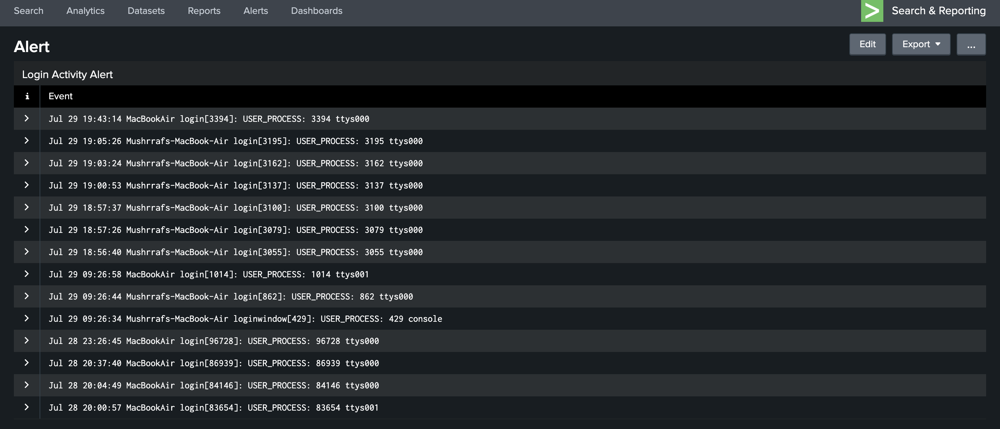
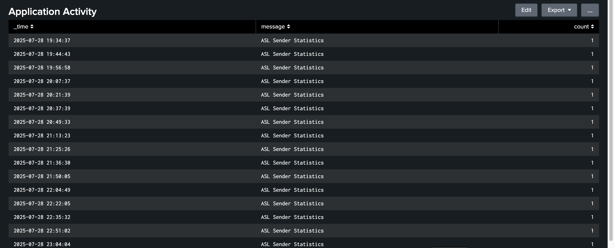
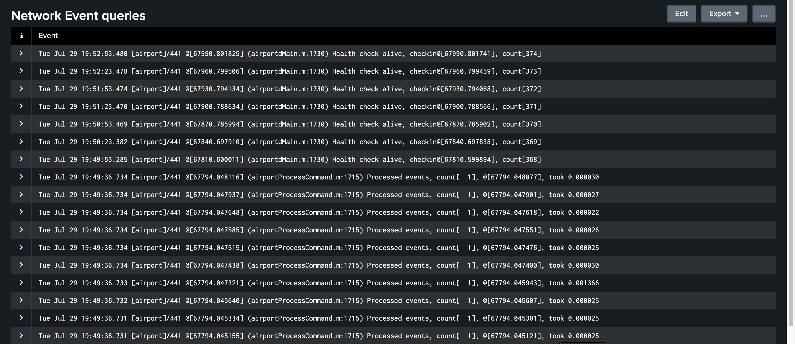

# Alerts for System Log Monitoring

## 🔐 Login Attempt Alert
**Query:** `login_attempts.spl`  
**Type:** Scheduled Alert  
**Condition:** Trigger alert if number of USER_PROCESS events > 5 in 1 hour  
**Action:** Send email

---

## 🛠 Application Activity Alert
**Query:** `application_activity.spl`  
**Type:** Scheduled Alert  
**Condition:** Trigger if `ASL Sender Statistics` message count drops or stays constant  
**Action:** Send email or Slack

---

## 🌐 Network Health Alert
**Query:** `network_events.spl`  
**Type:** Real-time Alert  
**Condition:** Trigger if `max_count` drops below 5000  
**Action:** Notify via webhook

